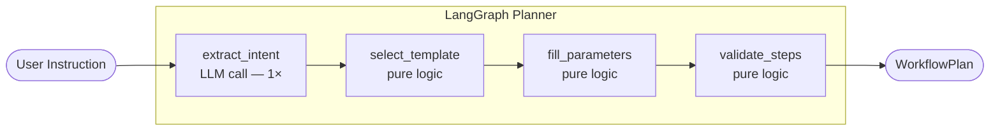
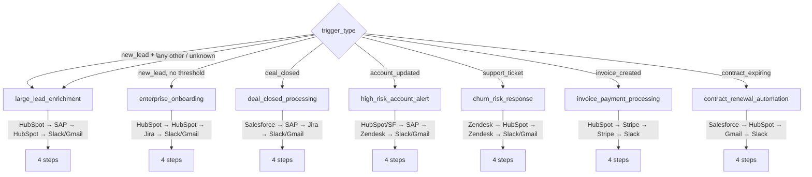
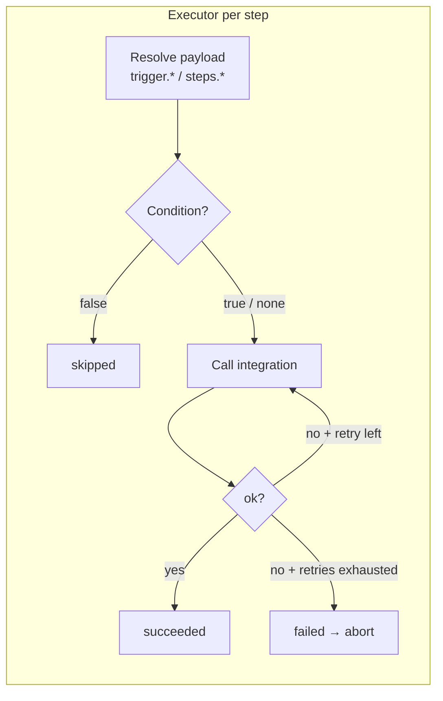

# Solution Notes

## What Changed

### 1. LLM-Driven Planner (LangGraph + Ollama)

The original prototype used keyword matching (`"sap" in text`, `"slack" in text`) to decide which steps to generate. I replaced it with a **LangGraph stateful graph** that calls a local Ollama LLM once to extract structured intent, then uses deterministic business logic to build the plan.



The LLM produces a typed `ExtractedIntent` (Pydantic model with structured output) containing `trigger_type`, `integrations`, `action_intents`, an optional `DetectedThreshold`, and a `workflow_name`. All downstream nodes are pure Python — no more LLM calls, fast and testable without Ollama running.

**Fallback contract:** if Ollama is unreachable at planning time, `extract_intent` silently sets `intent = None`. The graph continues through the other nodes and returns the `large_lead_enrichment` template with default parameters. The API never returns 500 due to an LLM outage.

**Warnings vs. errors:** the planner state separates `validation_errors` (hard failures that abort with `ValueError`) from `validation_warnings` (soft notices surfaced in logs, e.g. "No template for trigger_type 'invoice_updated'; using fallback").

### 2. Seven Workflow Templates

Seven named templates replace the freeform step-generation logic. Template selection is a deterministic rule set keyed on `trigger_type` and whether a `threshold` was detected:



**Adaptive notification step:** all templates use a shared `_build_notify_step` helper. If the LLM detected `"gmail"` in the user's instruction, the final step uses `MockGmailClient` (`send_email`) instead of Slack. The `churn_risk_response` template applies the same Gmail/Slack switch to its DM step.

**Adaptive integration selection:** each template calls `_pick_integration(intent, candidates, default)` so the LLM's detected integrations can override the default. For example, `high_risk_account_alert` picks HubSpot or Salesforce for the first step based on what the user mentioned.

### 3. Safe Condition Evaluator

The executor previously had one hardcoded condition check:

```python
if condition == "{{steps.step_get_company.employee_count}} > 500":
    ...
```

I replaced it with a `SafeConditionEvaluator` that parses `{{steps.STEP_ID.FIELD}} OPERATOR VALUE` via regex and evaluates it with direct Python comparisons — no `eval()`, no `exec()`. Unparseable conditions fail open (step runs) to preserve the existing behavior.

### 4. Executor Enhancements

**Step timing:** every `StepExecutionResult` now carries `started_at`, `completed_at`, and `duration_ms`. The `WorkflowExecution` carries total `duration_ms`.

**Retry logic:** steps can declare `retry: RetryConfig(max_attempts, delay_ms)`. The executor loops up to `max_attempts`, backing off `delay_ms` between attempts. By default all non-HubSpot steps in templates are given `RetryConfig(max_attempts=2, delay_ms=500)`.

**Generalized payload resolution:** `resolve_template` was extended from `{{trigger.company_id}}`-only to any `{{trigger.FIELD}}` or `{{steps.STEP_ID.FIELD}}`, enabling the new templates (Zendesk ticket_id, Salesforce account_id, Stripe invoice_id, etc.).



### 5. Integration Expansion

Added five new mock integrations (Salesforce, Zendesk, Jira, Stripe, Gmail) and new actions on existing ones (HubSpot: `create_deal`, `get_contacts`, `update_company_stage`; SAP: `check_compliance`, `get_credit_rating`; Slack: `send_dm`, `create_channel`).

The eight integrations and their supported mock actions:

| Integration | Actions |
|---|---|
| HubSpot | `get_company`, `create_task`, `update_company_stage`, `get_contacts`, `create_deal` |
| SAP | `enrich_company`, `get_credit_rating`, `check_compliance` |
| Slack | `send_message`, `send_dm`, `create_channel` |
| Salesforce | `get_account`, `create_opportunity`, `update_stage` |
| Zendesk | `create_ticket`, `escalate_ticket`, `assign_ticket` |
| Jira | `create_issue`, `update_issue` |
| Stripe | `create_invoice`, `finalize_invoice`, `charge_customer` |
| Gmail | `send_email`, `create_draft`, `get_thread` |

Company data varies by `company_id` so the demo is visually interesting:

| company_id | Employees | Threshold passes? |
|---|---|---|
| `company_demo` | 750 | ✓ |
| `company_small` | 120 | ✗ — downstream steps shown as skipped |
| `company_large` | 2400 | ✓ |
| anything else | 50 | ✗ |

### 6. API List Endpoints

Added `GET /workflows?limit=10&offset=0` and `GET /executions?limit=10&offset=0` with tenant-scoped pagination. Both return `{ items, total, limit, offset }`.

### 7. Domain Model

| Model | Addition |
|---|---|
| `WorkflowPlan` | `name: str` (human-readable, from LLM) |
| `WorkflowStep` | `retry: RetryConfig \| None` |
| `StepExecutionResult` | `started_at`, `completed_at`, `duration_ms` |
| `WorkflowExecution` | `started_at`, `duration_ms` |
| `IntegrationName` | `salesforce`, `zendesk`, `jira`, `stripe`, `gmail` |
| `PlannerState` | `validation_warnings: list[str]` (separate from hard errors) |

### 8. App State Isolation

The `InMemoryPrototypeStore`, planner, and executor were module-level singletons in `routes.py`, which leaked state across `TestClient` instances. I moved them into `app.state` (initialized in `create_app()`), so each test that calls `create_app()` gets a fresh, isolated store.

### 9. Frontend

- **Prompt chips:** four clickable example prompts below the textarea; clicking a chip fills the instruction field (no API call triggered)
- **Real-time detection banner:** as the user types, `detectTemplate` matches the instruction client-side and shows the detected workflow name, confidence level, and integration icons before any API call is made
- **Company selector:** a dropdown next to the Execute button lets users switch between `company_demo`, `company_small`, and `company_large`, making the conditional skip behavior visible in demos without editing code
- **Workflow name:** results header shows `plan.name` as the primary label; the UUID is shown as small monospace subtext with a workflow icon matched from the catalog
- **Step output panel:** execution results display key-value pairs from each step's `output`, `duration_ms` next to the step name, and a muted "condition not met — step skipped" label for skipped steps
- **Recent Runs panel:** loads last 5 executions on mount, refreshes after each new execution; empty state handled; shows duration and relative timestamp per run
- **Catalog modal:** "Browse all workflows & tools →" button opens a modal listing all 7 workflow templates (with trigger, description, and integration icons) and all 8 integrations (with supported actions); clicking a workflow card loads its prompt into the textarea

---

## Why These Changes

**LangGraph planner first.** The prototype's keyword matcher would break on any real instruction that doesn't use exact words like "sap" or "task". Replacing it with an LLM call for intent extraction is the highest-leverage improvement for product credibility. LangGraph was chosen because it makes each planning stage independently testable and the typed state prevents silent data loss between nodes.

**Fallback-safe by design.** A local Ollama instance will be down in many demo environments. Making the planner degrade gracefully (fallback template instead of 500) is a prerequisite for anything to work reliably.

**Condition evaluator before retry.** The hardcoded condition check was a liability — adding any new template would silently break conditions. Fixing it unblocks all seven templates without surprises.

**Retry and timing together.** Both touch the same executor loop. Doing them together avoids a second pass through the same code. Timing data is also what makes the frontend execution panel useful rather than just a status badge.

**Test coverage on business logic, not infra.** The four LangGraph nodes are tested with mocked LLM calls — no Ollama instance needed in CI. Integration tests cover all new mock actions. The planner graph test mocks at the node level so it tests graph wiring, not model responses.

**Frontend last.** The UI changes are presentational. They add value for a demo but don't affect correctness. They were done after the backend was solid.

---

## How To Run

### Prerequisites

```bash
# Pull the model (one-time, ~4.7 GB)
ollama pull llama3.1:8b   # or whichever OLLAMA_MODEL you set

# Start Ollama if it's not already running as a system service
ollama serve
```

> **Note:** If Ollama is unreachable, the planner falls back to the `large_lead_enrichment` template automatically — the API will not return errors.

### Docker Compose (quickest)

```bash
docker compose up --build
```

| Service | URL |
|---|---|
| Frontend | http://localhost:3100 |
| Backend | http://localhost:8100 |
| Health | http://localhost:8100/health |

The compose file sets `OLLAMA_BASE_URL=http://host.docker.internal:11434` so the backend container reaches the host-running Ollama instance. On Linux, replace `host.docker.internal` with the bridge IP (typically `172.17.0.1`) or use `--network=host`.

### Backend (local dev)

```bash
cd backend
python -m venv .venv
source .venv/bin/activate
pip install -e ".[dev]"
uvicorn app.main:app --reload --port 8100
```

### Tests

```bash
cd backend
pytest               # no Ollama required
ruff check app/ tests/
```

### Frontend (local dev)

```bash
cd frontend
npm install
npm run dev
```

---

## What You Would Improve Next

### Highest priority

**1. Structured validation errors vs. warnings.** The `validation_warnings` list (soft) and `validation_errors` list (hard) exist in the planner state but warnings are not surfaced in the API response. The API should return warnings alongside the plan so the frontend can display them to the user.

**2. Payload schema per integration action.** Right now templates can reference any field name and the executor will silently pass wrong payloads. Each integration action needs a declared input schema so `validate_steps` can catch `{{steps.step_get_company.typo_field}}` at plan time, not at execution time.

**3. Execution DAG, not just sequential.** The `depends_on` field is modeled and validated, but the executor runs steps strictly sequentially. Steps without shared dependencies (e.g., `step_create_task` and `step_check_compliance`) could run concurrently, cutting wall-clock time for multi-branch workflows.

**4. Persistent store.** The in-memory store is wiped on restart. A SQLite-backed store (the dependency is already in `pyproject.toml`) would make the demo survive a server restart and enable pagination over a real dataset.

**5. Auth beyond the demo token.** The current auth accepts any `Authorization: Bearer demo-token` header. Real multi-tenant isolation needs JWT validation with per-tenant claims, not a single shared token.

### Medium priority

**6. Streaming plan output.** LLM calls can take 3–8 seconds on a cold Ollama start. Streaming the intent extraction result (or at least a "planning…" SSE heartbeat) would prevent the frontend from appearing frozen.

**7. Observability.** Add structured logging (JSON lines) with `trace_id` per planning request, LLM latency tracking, and step execution timing exported to a time-series backend. Right now `duration_ms` is computed but not surfaced anywhere beyond the API response.

**8. Frontend type safety.** The frontend uses `as Promise<T>` casts instead of runtime validation. Adding a Zod schema for API responses would catch backend/frontend contract drift at the boundary rather than as a runtime surprise.

**9. Model fallback chain.** If `llama3.1:8b` is unavailable, try `qwen2.5:7b`, then `mistral:7b-instruct`, before falling back to the rule-based template. This makes the LLM path more resilient to partial Ollama availability.

**10. Template extensibility.** Adding a new template currently requires editing `templates.py`, `select_template.py`, and the frontend catalog. A declarative template registry (YAML or a class with metadata) would reduce the surface area for omissions.
